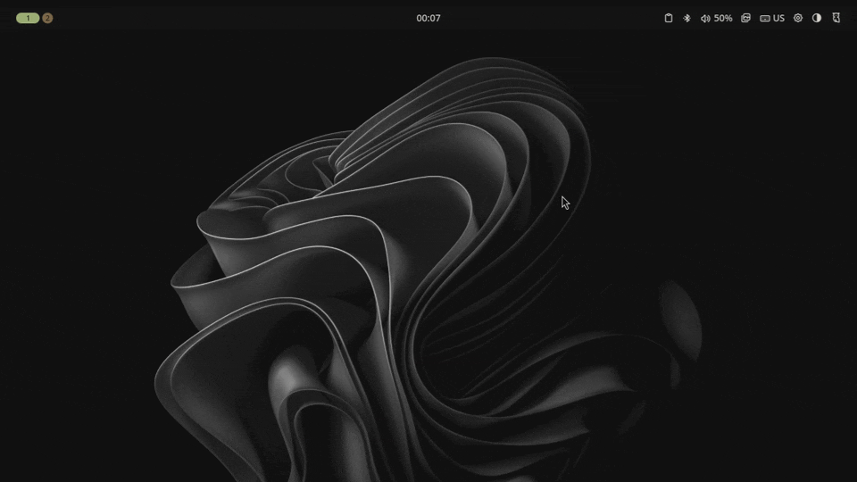

# Noctalia v5 — Per-Mode Wallpaper · Automatic Dark/Light Theme Wallpaper Switcher

**Automatically change your wallpaper when you switch between dark and light theme
mode in [Noctalia](https://noctalia.dev) v5** on Wayland (Hyprland, Niri, and any
supported compositor). A tiny, dependency-free POSIX-sh helper that remembers a
**separate wallpaper for dark and light mode** — set a different background for
each theme and it switches automatically.

## Demo



*Toggling theme mode swaps the wallpaper automatically — each mode keeps its own.*

> Keywords: noctalia, noctalia v5, noctalia shell, wallpaper, dark mode, light
> mode, dark/light wallpaper, automatic wallpaper switcher, theme-aware wallpaper,
> per-mode wallpaper, wayland, hyprland, niri, quickshell, ricing, linux desktop,
> dotfiles.

There's no fixed "dark path / light path" to configure — it simply remembers
*whatever wallpaper you set while in a mode* and restores it when you switch back.

- Switch dark → light → your light wallpaper comes back
- Switch light → dark → your dark wallpaper comes back
- Pick a new wallpaper in either mode → that becomes the remembered one

It's driven entirely by Noctalia's built-in **hooks** + **IPC** (`noctalia msg`),
so it works on any compositor and needs no extra dependencies.

> Built against Noctalia v5. The v5 plugin API can't do this yet (no wallpaper
> getter and no theme/wallpaper change events), so a hook script is the way.

## Quick install with an AI agent

Using a coding agent (Claude Code, etc.)? Paste this prompt and it'll do the
whole setup for you:

> Set up the "per-mode wallpaper" helper for Noctalia v5 on my machine:
>
> 1. Download the script from
>    `https://raw.githubusercontent.com/farhadeidi/noctalia-dark-light-wallpaper/main/wallpaper-per-mode.sh`
>    to `~/.config/noctalia/scripts/wallpaper-per-mode.sh` and `chmod +x` it.
> 2. In `~/.config/noctalia/config.toml`, add (or merge into) a `[hooks]` section
>    that wires **both** `wallpaper_changed` and `theme_mode_changed` to that
>    script, using my **absolute** home path (TOML can't expand `~`). Don't
>    overwrite any existing config — merge.
> 3. Run `noctalia msg config-reload`, then `noctalia config validate` to confirm
>    it's valid.
>
> Then explain how to use it (set a wallpaper in dark mode, toggle to light, set
> another — each mode remembers its own).

## Manual install

1. Save the script and make it executable:

   ```sh
   mkdir -p ~/.config/noctalia/scripts
   curl -o ~/.config/noctalia/scripts/wallpaper-per-mode.sh \
     https://raw.githubusercontent.com/farhadeidi/noctalia-dark-light-wallpaper/main/wallpaper-per-mode.sh
   chmod +x ~/.config/noctalia/scripts/wallpaper-per-mode.sh
   ```

2. Wire it to both hooks in `~/.config/noctalia/config.toml`
   (TOML can't expand `~`, so use your **absolute** home path):

   ```toml
   [hooks]
   wallpaper_changed  = ["/home/YOURNAME/.config/noctalia/scripts/wallpaper-per-mode.sh"]
   theme_mode_changed = ["/home/YOURNAME/.config/noctalia/scripts/wallpaper-per-mode.sh"]
   ```

3. Reload Noctalia's config (or restart it):

   ```sh
   noctalia msg config-reload
   ```

That's it. Toggle your theme with `noctalia msg theme-mode-toggle` (or via the
Settings UI) and the wallpaper follows.

## How it works

State lives in `~/.config/noctalia/state/`:

| file              | purpose                                   |
| ----------------- | ----------------------------------------- |
| `wallpaper-dark`  | remembered wallpaper path for dark mode   |
| `wallpaper-light` | remembered wallpaper path for light mode  |
| `last-mode`       | last seen mode, used to detect a switch   |

On each hook the script reads the current mode (`theme-mode-get`) and wallpaper
(`wallpaper-get`):

- **mode changed** → restore that mode's saved wallpaper (seeding it from the
  current one the first time a mode is seen)
- **mode unchanged** → you must have picked a new wallpaper, so remember it

Restoring sets the wallpaper, which re-fires `wallpaper_changed`, but that just
re-saves the same path (idempotent) and a guard skips redundant sets — no loop.

## Notes / caveats

- Uses the **global** (all-monitor) wallpaper via `noctalia msg wallpaper-get` /
  `wallpaper-set`. Per-monitor memory would need a small extension.
- Assumes the mode is already updated by the time the hook fires. If you ever see
  a wallpaper saved to the wrong mode, it's an event-ordering edge — open an issue.

## FAQ

**How do I set a different wallpaper for dark and light mode in Noctalia?**
Install this hook script, then just set the wallpaper you want while in each mode
— it remembers and restores them automatically on every theme switch.

**Can Noctalia change the wallpaper automatically when the theme changes?**
Not built-in yet, but this script adds exactly that using Noctalia's `hooks` +
`noctalia msg` IPC.

**Does it work on Hyprland and Niri?**
Yes. It only uses Noctalia IPC, so it's compositor-agnostic and works anywhere
Noctalia v5 runs.

**Why not a Noctalia plugin?**
As of v5 the plugin API has no wallpaper getter and no theme/wallpaper change
events, so a hook script is currently the only way to do per-mode wallpapers.

## License

[MIT](LICENSE) — do whatever you like.
